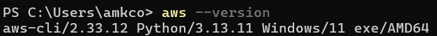
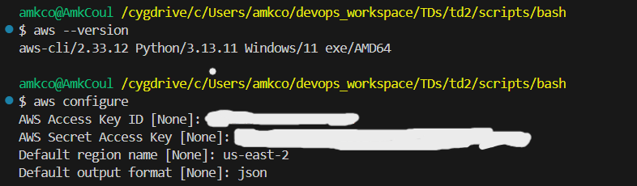
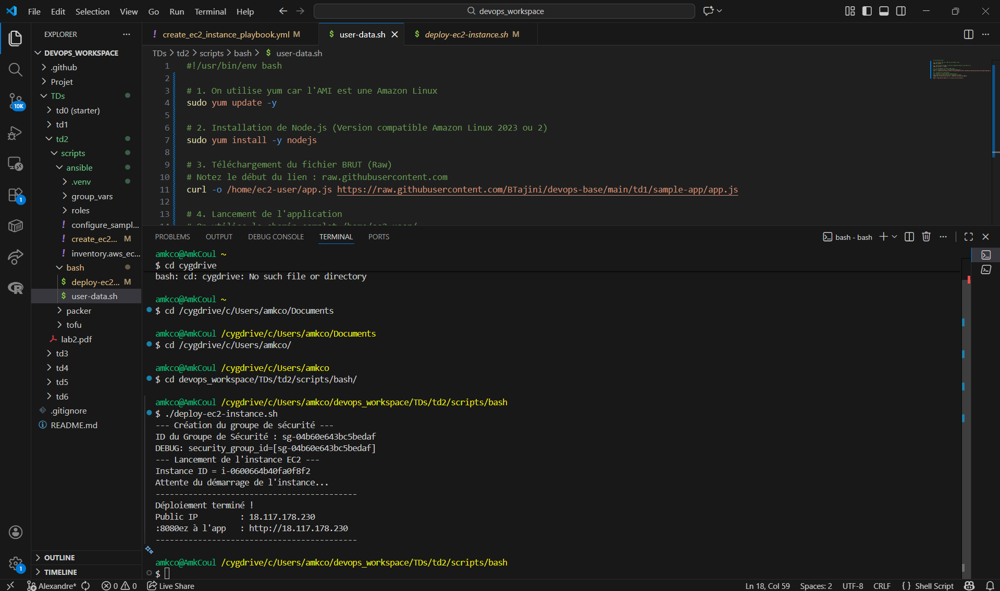
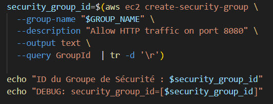
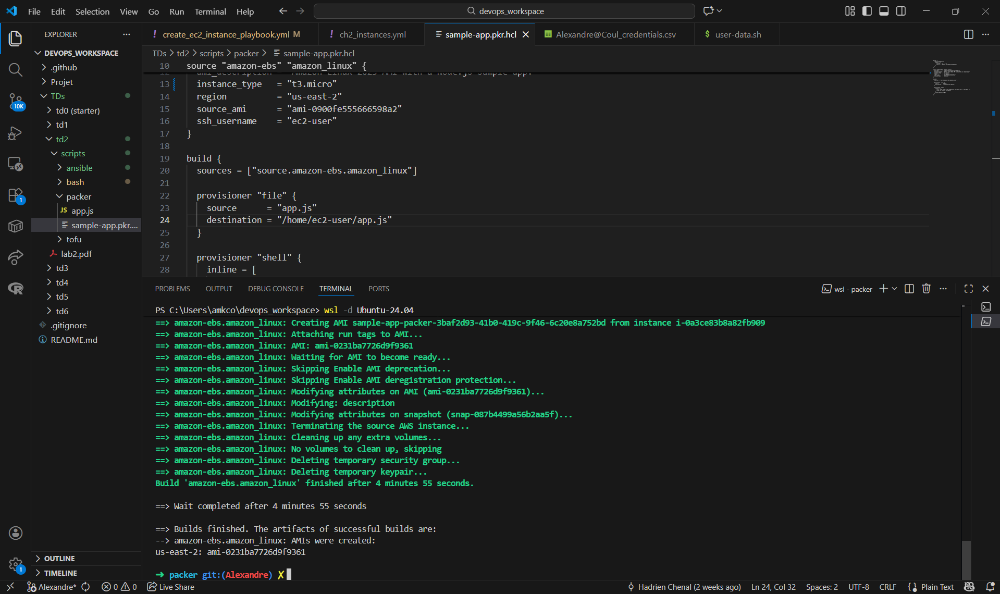
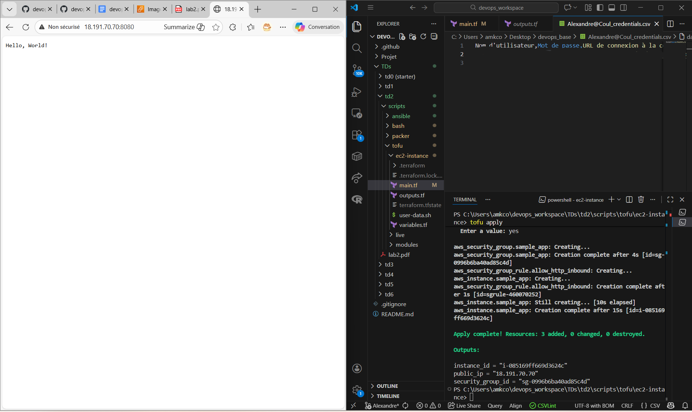
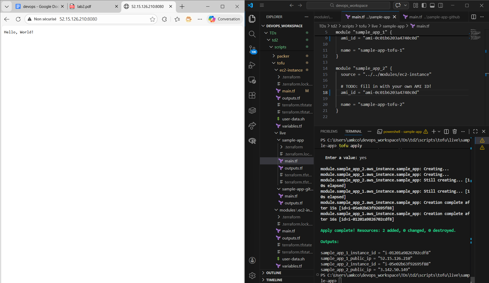

# Lab 2: Managing Infrastructure as Code (IaC)

Dans ce laboratoire, nous apprenons à gérer une infrastructure en tant que code (Infrastructure as Code – IaC) à l’aide de différents outils et techniques. Au lieu de configurer et de déployer manuellement notre infrastructure, nous allons automatiser ce processus à l’aide de code, rendant les déploiements plus rapides et moins sujets aux erreurs. Pour ce faire, nous utilisons plusieurs outils d’infrastructure (Bash, Ansible, Packer, OpenTofu).

## Prérequis

- Tout d’abord, nous devons télécharger et installer AWSCLI sur notre environnement local. Cette interface est notre passerelle dans la communication entre nos scripts locaux et nos déploiements en ligne.

- Autre étape importante : Notre mission aura pour but de pouvoir interagir avec les services AWS de manière programmatique. Il est alors nécessaire de s’authentifier à l’aide de clés AWS. En effet, ces clés nous permettent de nous identifier et d’autoriser l’accès aux ressources AWS depuis une interface en ligne de commande.

On vient alors créer une clé d’accès depuis la plateforme AWS, avec comme cas d’utilisation Command Line Interface (CLI). Une fois la clé créée, AWS fournit 2 informations essentielles:

→ ACCESS Key ID : Identifiant unique

→ SECRET ACCESS KEY : Clé d’authentification

Nous devons impérativement enregistrer ces informations, car elle ne pourra pas être récupérée ultérieurement. Ces identifiants sont ensuite utilisés dans la ligne de commande ou dans les outils d’automatisation afin d’établir une connexion sécurisée avec AWS. Grâce à cette authentification, l’utilisateur peut gérer et déployer des ressources AWS sans passer par l’interface graphique, ce qui constitue une étape fondamentale dans la mise en place de l’Infrastructure as Code (IaC).

On peut maintenant commencer nos déploiements ! 

## 1. Automatisation par Script Bash 

⇒ L'objectif était de déployer une instance EC2 et un groupe de sécurité via l'AWS CLI. Cette instance sera une page web du script app.js, affichant le message “Hello, World !” 
Pour cette étape, on se munit de 2 scripts Shell:

→ user-data : Initialisation et configuration de la machine. Elle permet d’exécuter automatiquement un script au démarrage d’une instance EC2 grâce à Node.js.

→  deploy-ec2-instance : Script principal. Il automatise le déploiement d’une infrastructure AWS à l’aide d' AWS CLI. Il commence par configurer la régon AWS et charge le script <i>user-data</i> destiné à être exécuté au démarrage de l’instance EC2. Il vient ensuite créer un groupe de sécurité, autorisant le trafic HTTP entrant sur le port 80, puis lance l’instance en associant le groupe de sécurité. Enfin, le script attend que l’instance soit opérationnelle et récupère son adresse IP publique, permettant ainsi d’accéder à l’application déployée.
Une fois mis en place, nous rendons le script exécutable et lançons avec la commande. 

Sortie : 

Page Web : 

### Problèmes rencontrés : 
Nous devions modifier ce script car il ne correspondait pas à nos paramètres.

1. Port : En effet pour Node.js, le port standard est 8080 et non 80.
2. Type d’instance : le type d’instance “t2.micro” était obsolète. Afin de lancer gratuitement une instance, on remplace par “t3.micro”. 
3. L’erreur la plus importante : lorsque nous lancions notre script, nous trouvions une erreur de malformation de groupe de sécurité. En effet, le groupe ne se formait pas correctement et comptabilisait un caractère en plus, faussant nos résultats. Après plusieurs analyses et conseils avec l’IA, nous nous sommes rendu compte que ce problème était lié à notre machine : pour un utilisateur Windows, un saut de ligne était automatiquement effectué à chaque création de groupe de sécurité. Afin de le corriger, on ajoute une condition "<strong><i>tr -d '/r'</i></strong>" qui permet de supprimer les caractères de retour, et ainsi garder que l’information nécessaire.

#### Exercices

<strong>Exercice 1 :</strong> Si nous lançons le script une seconde fois, une erreur surviendra car le script tente de créer un groupe de sécurité avec un nom déjà existant (sample-app). Contrairement à des outils IaC avancés, un script Bash simple n'est pas nativement idempotent.

<strong>Exercice 2 :</strong> Pour déployer plusieurs instances, il faudrait modifier la commande aws ec2 run-instances avec le paramètre --count ou encapsuler la commande dans une boucle for.

## 2. Configuration avec Ansible

Ansible est utilisé ici pour le provisionnement et la configuration logicielle (Node.js). Afin de créer notre instance, nous créons les scripts suivants dans cette architecture : 

<pre>Ansible
|-- .venv                              # Dossier environnement virtuel
|-- create_ec2_instance_playbook.yml                      
|-- inventory.aws_ec2.yml                            
|-- configure_sample_app_playbook.yml
|-- roles    
│   |-- sample-app
│   │   |-- files
|   |   |   |-- app.js 
│   │   |-- tasks
|   |   |   |-- main.yml 
│   |-- groups_vars
│   │   |-- ch2_instances.yml

</pre>

→ create_ec2_instance_playbook.yml : Création de notre instance AWS. On y crée un groupe de sécurité <i>sample-app-ansible</i> et une clé <i>ansible-ch2.key</i> qui nous permet de communiquer avec notre instance en ligne.

→ inventory.aws_ec2.yml : Inventaire dynamique AWS. Il permet à Ansible de se connecter à AWS et chercher les instances EC2 pour les utiliser comme hôtes. 

→ ch2_instances.yml : Définit le user SSH et la clé privée. 

→ configure_sample_app_playbook.yml : Configuration de l'application. 

Donc en résumé, lorsque l'on applique cette commande : 

<pre>ansible-playbook -v create_ec2_instance_playbook.yml
</pre>

<strong>==> On crée un playbook Ansible qui va se connecter à la plateforme en ligne et associer plusieurs caractéristiques uniques (AMI, security group, clé,...). Ensuite, lors de l'appel : </strong>

<pre>ansible-playbook -v -i inventory.aws_ec2.yml configure_sample_app_playbook.yml
</pre>

<strong>==> Notre commande va chercher les EC2 correspondantes à la configuration et se connecter en SSH pour installer l'application liée (ici notre page Web "Hello, World").</strong>

Une fois cela créé, nous devons passer à l’étape du déploiement, où nous rencontrons plusieurs problèmes.

### Problèmes rencontrés : 

1. Afin de pouvoir lancer l’instance, nous devons installer Ansible sur Ubuntu. Seulement, notre installation n’aboutissait pas. Même en cherchant, nous ne trouvons pas l'erreur indiquée. Donc, nous avons réfléchi à une solution : créer un environnement virtuel, où serait stocké notre installation Ansible et autres packages nécessaires pour le déploiement (botocore, boto3). Cette méthode s’est montrée efficace et nous avons pu procéder correctement pour la prochaine étape.

2. Une fois ce problème résolu, nous lançons la première commande : cela a permis de créer une clé d’accès ansible-ch2.key. Cette clé est protégée et alors impossible à utiliser. Alors nous devions modifier ses <strong>permissions</strong>, mais nous nous heurtons à un mur: nous ne pouvions pas les modifier au sein de l’architecture. Alors nous devions changer l’emplacement de cette clé créée et changer ses permissions là-bas. Nous la déplaçons dans un dossier dédié à la clé et réussissons à rendre la clé lisible. 

<strong>==> Malheureusement, suite à ces nombreux problèmes, je n'ai pu obtenir qu'un résultat efficient de déploiement, que je n'ai pas prise en capture d'écran. Les autres tentatives furent toujours défectueuses à l'appel de la deuxième commande. C'est pourquoi je ne peux pas fournir de visualisation de résultat.</strong>

#### Exercices

<strong>Exercice 3 :</strong> Contrairement au script Bash, exécuter le playbook une seconde fois ne produira pas d'erreur. Ansible vérifie l'état actuel et ne modifie les ressources que si elles ne correspondent pas à la cible (par exemple, il ne réinstallera pas Node.js s'il est déjà présent).

<strong>Exercice 4 :</strong> Pour plusieurs instances, on modifierait l'inventaire (inventory.aws_ec2.yml) ou on utiliserait des groupes d'hôtes plus larges dans le playbook.

## 3. Création d'images avec Packer

Dans cette section, nous allons utiliser Packer pour créer une AMI (Amazon Machine Image) pour notre sample app Node.js.

Tout d’abord, nous devons installer Packer sur Ubuntu. On se rend alors sur <a href=https://developer.hashicorp.com/packer/install>Install | Packer | HashiCorp Developer</a> et effectue ces commandes : 

<pre>wget -O - https://apt.releases.hashicorp.com/gpg | sudo gpg --dearmor -o /usr/share/keyrings/hashicorp-archive-keyring.gpg
echo "deb [arch=$(dpkg --print-architecture) signed-by=/usr/share/keyrings/hashicorp-archive-keyring.gpg] https://apt.releases.hashicorp.com $(grep -oP '(?<=UBUNTU_CODENAME=).*' /etc/os-release || lsb_release -cs) main" | sudo tee /etc/apt/sources.list.d/hashicorp.list
sudo apt update && sudo apt install packer
</pre>

Une fois cela effectué, on crée un fichier HCL sample-app.pkr. Ici, on crée une image machine (AMI) pré-configurée avec l'application. On obtient alors I’ID de cet AMI, que l’on récupère pour pouvoir utiliser ultérieurement.

#### Exercices

<strong>Exercice 5 :</strong> Relancer packer build échouera si le nom de l'AMI (ami_name) n'est pas unique.

## 4. Provisionnement avec OpenTofu

OpenTofu gère le cycle de vie complet des ressources. Pour installer cet outil, nous utilisons cette commande (<a href=https://opentofu.org/docs/intro/install/windows/>Pour Windows</a>) : 

<pre>winget install --exact --id=OpenTofu.Tofu
</pre>

Une fois cela effectué, on effectue l’architecture suivante avec les codes : 

<pre>tofu
|-- ec2-instance
│   |-- main.tf
│   |-- outputs.tf
│   |-- variables.tf
|-- live
│   |-- sample-app
│   │   |-- main.tf
│   │   |-- outputs.tf
│   |-- sample-app-github
│   │   |-- main.tf
│   │   |-- outputs.tf
|-- requirements.txt                            
|-- README.md
|-- modules    
│   |-- ec2-instance
│   │   |-- main.tf
│   │   |-- outputs.tf
│   │   |-- variables.tf 
</pre>

<i>Pour cette étape, on vient dans ./tofu/ec2instance : </i>

→ variables.tf : On définit nos variables d'entrées. On veut pouvoir déployer notre application grâce à l'AMI résultante de la dernière étape.  

→ main.tf : Moteur du déploiement. On instancie notre groupe de sécurité et ses protocoles ainsi que l'instance de l'application du fichier <i>user-data.sh</i>.

→ outputs.tf : Retourne les IDs de l'instance, le groupe de sécurité et de l'adresse IP. On peut alors accéder à notre page web.  

<strong>==> Une fois cela effectué, on utilise les commandes suivantes pour respectivement initialiser Opentofu et appliquer notre configuration :</strong> 

<pre>tofu init
tofu apply
</pre>

On obtient une adresse IP : elle correspond bien à la réponse souhaitée : 

<i>P.S. : Veillez à rester dans le dossier où se trouver vos fichiers .tf pour ne pas avoir d'erreurs. </i>

Une fois votre instance terminé, pensez à la détruire avec la commande <i> tofu destroy </i>.

#### Exercices

<strong>Exercice 7 :</strong> Si on lance tofu apply après un tofu destroy, OpenTofu recréera simplement l'intégralité de l'infrastructure à partir de zéro, car il constate que l'état actuel est vide.

<strong>Exercice 8 :</strong> Pour éviter la duplication de code, on utilise les arguments count ou for_each pour créer plusieurs instances de manière programmatique.

## 5. Deploying an EC2 Instance Using an OpenTofu Module

Nous allons effectuer la même logique mais cette fois-ci, nous déployons 2 instances EC2 à partir d'une seule AMI.

On se déplace dans un dossier ./tofu/modules/ec2-instance/ et on copie tous les fichiers vu précédemment dedans. On ouvre variables.tf et on ajoute une requête qui récupère le nom direct d'une instance et de toutes ses ressources. Une fois fait, on initialise et on applique la commande : 

<pre>tofu apply -var ami_id=YOUR_AMI_ID
</pre>

<i>avec YOUR_AMI_ID l'AMI généré de Packer. </i>

On nous demande alors de donner un nom, que l'on choisit, puis on attend que les deux instances finissent à configurer. On obtient ainsi <strong>deux adresses IP fonctionnelles </strong> à partir d'un même module. 

## 6. Using OpenTofu Modules from GitHub

Dernière étape : cette fois-ci on veut déployer en utilisant Github. On modifie la source de configuration de sample_app en y posant le lien Github de notre compte, correspondant au même chemin que notre dossier ./modules/ec2-instance. On applique à nouveau les commandes vues avant et on obtient une nouvelle adresse IP. 

Malheureusement, un autre problème s'est installé : le manque de place sur le disque dur. Le déploiement était alors infructueux. 

## Conclusion

<strong>Dans ce TP, nous avons exploré différents outils et techniques pour gérer l'infrastructure en tant que code. On a pu alors configuré et déployé des instances EC2 à l'aide de scripts Bash, Ansible, Packer et Opentofu. Ce dernier nous a appris également à utiliser des modules afin d'améliorer la réutilisation et l'organisation du code. 
Au final, nous avons étudié les points forts et faibles de ces outils, afin de savoir quand les utiliser dans notre gestion d'infrastructure. </strong>

